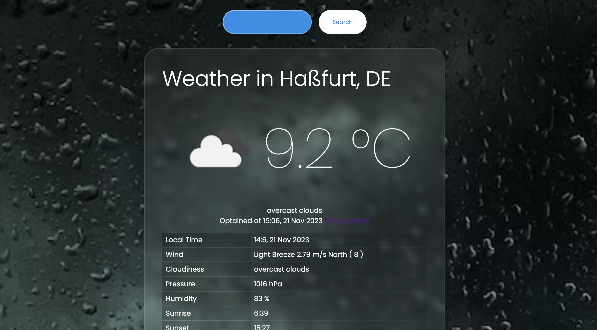
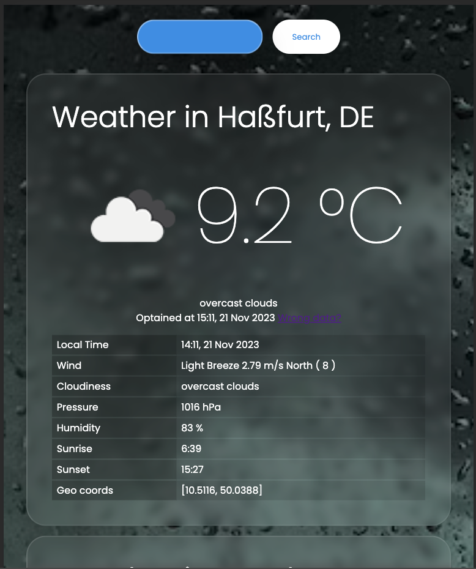
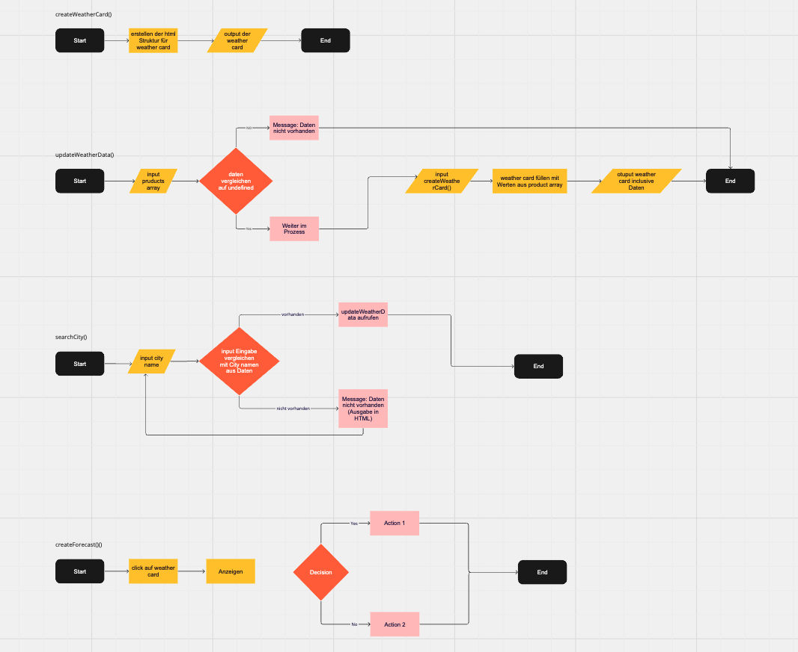
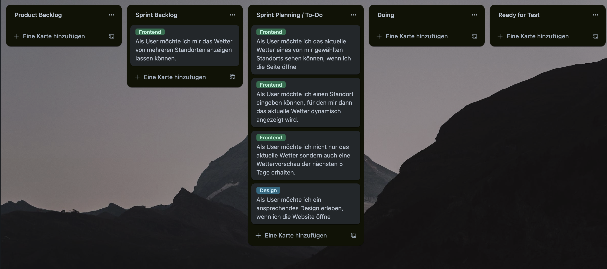
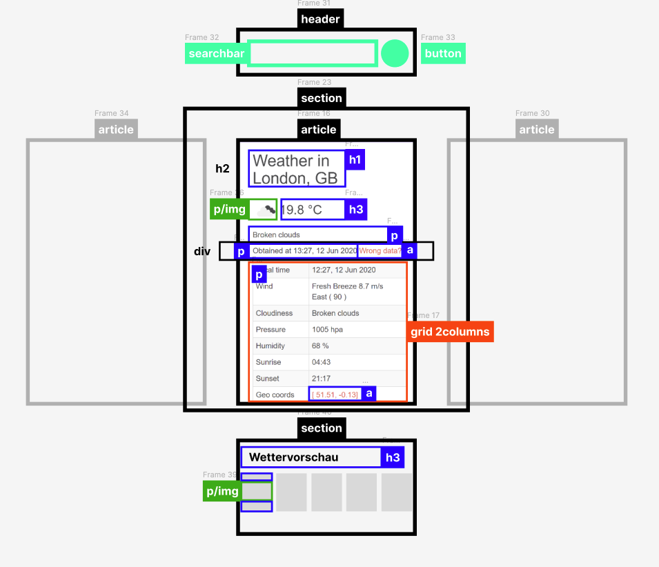

# Weather App

In this project, current weather data from several different cities are displayed. First, the weather of the user's correct location is automatically shown. All subsequent locations are permanently integrated. Additionally, a location can be searched for and displayed.

## Table of Contents

- [Overview](#overview)
  - [Screenshot](#screenshot)
  - [Links](#links)
- [My process](#my-process)
  - [Built with](#built-with)
  - [What I learned](#what-i-learned)
  - [Continued development](#continued-development)
  - [Useful resources](#useful-resources)
- [Author](#author)

## Overview

### Screenshot

#### Desktop:

#### Tablet

#### Flowchart

#### Project in Progress

#### HTML draft

#### To-Do's

### Links

- Solution URL: [index.html](https://github.com/wilhelm-lenz/weather-app/blob/main/index.html)
- Solution URL: [style.css](https://github.com/wilhelm-lenz/weather-app/blob/main/assets/css/style.css)
- Solution URL: [main.js](https://github.com/wilhelm-lenz/weather-app/blob/main/assets/js/main.js)
- Live Page URL: [Weather App Live](https://wilhelm-lenz.github.io/weather-app/)

## My Process

### Built With

- Semantic HTML5 markup
- SCSS custom properties
- JavaScript

### What We Learned

During the development of this application, we faced various challenges that we had to overcome. In particular, working with git in a team often posed difficulties for us. Additionally, we realized that we lacked a schedule to keep track of time.

### Continued Development

In the next development phase, the focus will be on the weather forecast feature, which has not yet been implemented in this project. Moreover, adherence to best practices will be emphasized to streamline the code in general. The HTML structure will also be revised to improve its semantics, and later, the project will be expanded to include responsiveness.

### Nützliche Ressourcen

- Netlify - [@app.netlify](https://app.netlify.com/drop/) [@netlify](https://netlify.com): Netlify is a development platform that enables scaling a web application. For example, a programmed web application can easily be converted into a mobile web app.

## Autor

- Johanna - [@johann3r](https://github.com/johann3r)
- Wilhelm Lenz - [@wilhelm-lenz](https://github.com/wilhelm-lenz)
